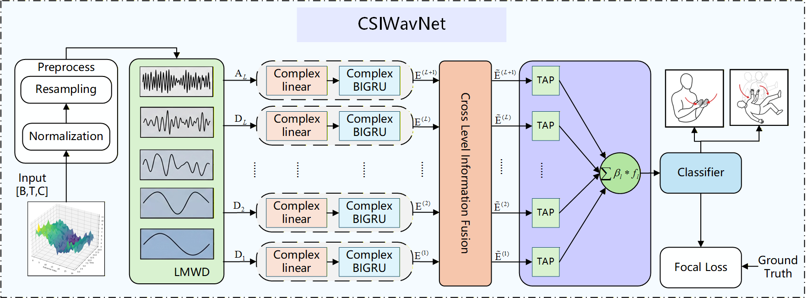

# CSIWavNet

**A Complex-Valued Wavelet Network for Multi-Granularity WiFi CSI-Based Activity Recognition**

> 📄 *Submitted to* **IEEE Internet of Things Journal (IoTJ)**, 2026.
> Status: *Under Review*

---

## 📌 Overview

CSIWavNet is a **lightweight complex-valued wavelet network** for human activity recognition (HAR) based on WiFi Channel State Information (CSI). It targets two long-standing challenges in CSI sensing:

1. **Multi-granularity activities live on different frequency bands.** Coarse body movements (walking, falling) and fine-grained gestures (hand waving, finger motion) exhibit heterogeneous time-frequency characteristics that single-scale models fail to capture simultaneously.
2. **The complex-valued nature of CSI is underutilized.** Conventional real-valued networks discard or flatten the phase component, losing the intrinsic amplitude–phase coupling that carries rich motion information.

CSIWavNet addresses both issues with a unified complex-valued architecture, providing a single framework that works across coarse- and fine-grained WiFi sensing tasks.

---

## 🏗️ Architecture

*The overall architecture of CSIWavNet, consisting of a learnable multi-kernel complex wavelet module, a complex-valued bidirectional GRU encoder, and a cross-level adaptive aggregation head.*

---

## ✨ Key Contributions

- 🌊 **Learnable Multi-Kernel Complex Wavelet Module** — adaptively decomposes CSI signals into task-relevant time–frequency subbands instead of relying on hand-crafted wavelet bases.
- 🔁 **Complex-Valued BiGRU (BiCGRU) Encoder** — captures temporal dependencies in both directions while preserving the intrinsic amplitude–phase coupling of CSI measurements.
- 🎯 **Cross-Level Fusion & Adaptive Hierarchical Aggregation** — dynamically emphasizes discriminative frequency components for activities of different granularities.

---

## 📊 Results

CSIWavNet is evaluated on three public WiFi CSI HAR benchmarks:

| Dataset      | Accuracy   |
| :----------- | :--------- |
| Widar3.0     | **97.32%** |
| UT-HAR       | **99.76%** |
| HUST-HAR     | **99.44%** |

The model demonstrates strong performance across both **coarse-grained** activities (Widar3.0, UT-HAR) and **fine-grained** gestures, validating its generalization across granularity scales.

---

## 🔒 Code Availability

The full source code and pretrained models will be released **upon acceptance of the paper**. For early access or collaboration inquiries, please feel free to contact the author.

© 2026 Your Name. All rights reserved.
